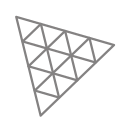

### Hi there 

I am Houssem Lachtar, and I am a Marketing grad from ISG Tunis, and I am now studying business analysis and data science as a master grade.<!---a Master&apos;s student in Digital Marketing at the&nbsp;🏛&nbsp;Higher Institute Of Management Of Tunis.--> I am a Photographer, Video Editor and Front-End Developer. You can find some of my work <!---on [ my codepen](https://codepen.io/houssem-lachtar) and of course, here--> on [ my github](https://github.com/houssemlachtar). I&apos;m launching [🌐 my main website](#) very soon. This is [my minimalistic portfolio](https://minimalistic-portfolio-azure.vercel.app)

- 🌱 I&apos;m currently learning everything 🤣
- 👯 I&apos;m looking to collaborate with other developers
- 🥅 2022 Goals: Learn more about web3
- ✨ Hobby: Music, Film industry and Information technology 
- ⚡ Fun fact: I love to go to the gym and play guitar and drums
- 🐾 Also fun fact: Dog and cat lover
 

### Connect with me:

Send me an [✉️ email](mailto:lachtarhoussem7@gmail.com),  Or just 💬&nbsp;come say hi on  

&nbsp;&nbsp;

&nbsp;&nbsp;

### Programming Languages and Tools I use:  

 
 
 

<table align="center">
      <tr>
        <td width="100%" align="center">
          <a href="https://personal-projects-inky.vercel.app">View Latest Projects</a>
        </td>
      </tr>
 </table>
